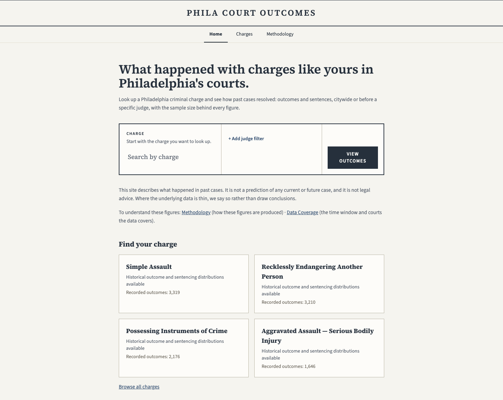
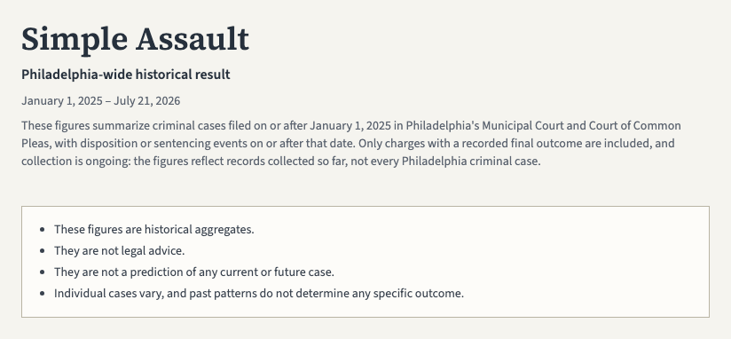
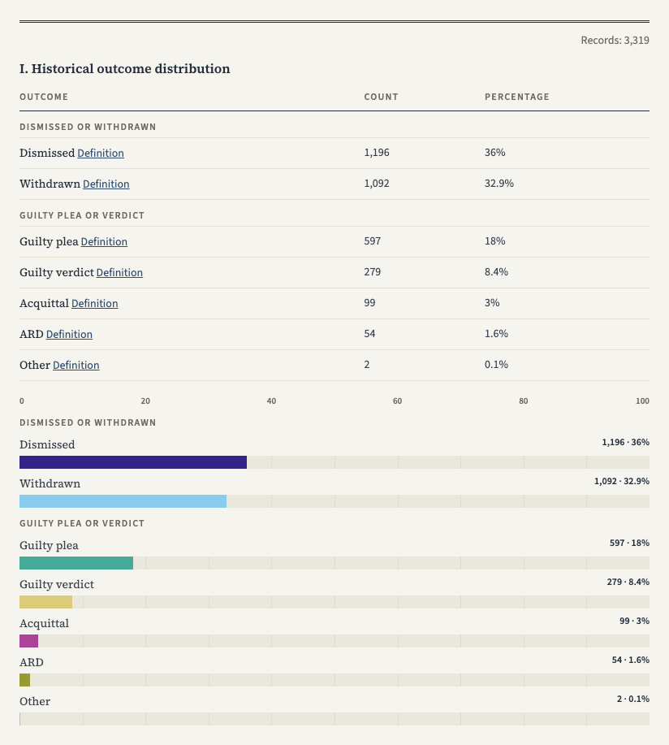
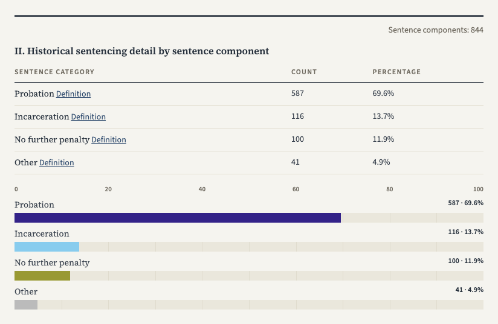
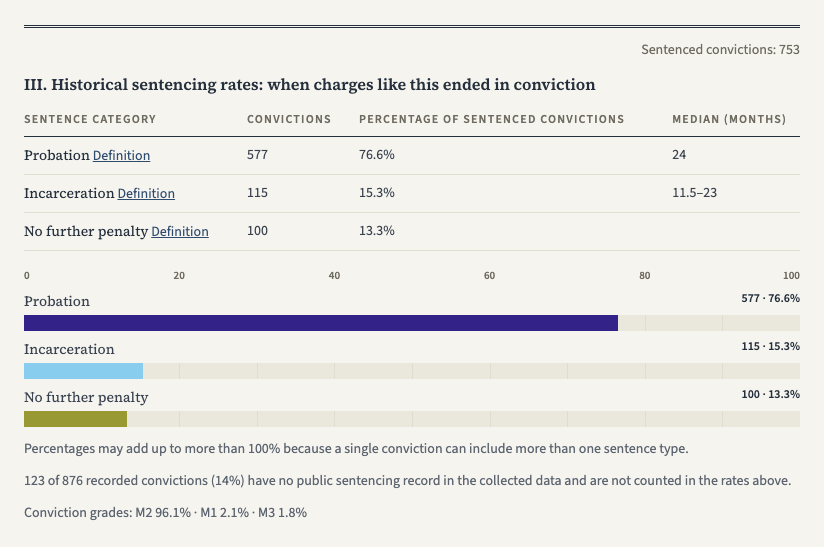
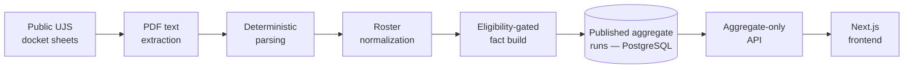

# Philadelphia Court Outcomes

[](https://github.com/philay3/Phila-Court-Analytics/actions/workflows/ci.yml)

See how criminal charges in Philadelphia's courts have resolved — historical, aggregate
outcomes and sentences built from public court records.

**Live site:** <https://philacourtoutcomes.org>



_Screenshots are point-in-time captures of the live site. Collection is ongoing: served
figures grow as newly collected records are aggregated, so the live site always
supersedes any figure visible in an image._

## What it is

Search a Philadelphia criminal charge and see how past cases with that charge resolved —
outcomes and sentences, citywide or by judge where available. The site is built first for
people facing charges who want plain historical context, and second for attorneys and
researchers. Every figure is a historical aggregate with its sample size shown; small
samples are labeled as thin data rather than hidden.

It is deliberately narrow about what it is not:

- **Not a prediction.** Figures are historical summaries. Past distributions
  do not predict what a court will decide in any current or future case.
- **Not legal advice.** This site does not provide legal advice. Nothing here
  is a substitute for consulting a licensed attorney about a specific
  situation.
- **Not a judge comparison or scoring product.** Results describe groups of
  past cases as a whole, never any individual case, and the product draws no
  conclusions about any judge or court.

The same statements are served to users in the application itself, on the
[methodology page](https://philacourtoutcomes.org/methodology).

## Using the site

### Find your charge

Search from the homepage, start from a featured charge card, or browse the full
directory at [/charges](https://philacourtoutcomes.org/charges) — every listed charge
links to its result page.


### An example: simple assault

Every result page opens the same way. Here is the citywide page for simple assault: the
charge, the covered date window, a plain statement of what the figures summarize, and
the responsible-use notes.



### The outcome distribution

First comes the outcome distribution: how past cases with this charge were resolved.
Its unit is the **record** — one charge's disposition, its recorded final outcome.
Outcomes are grouped into plain categories — dismissed or withdrawn, guilty plea or
verdict — each with its count and percentage, and every category links to a
plain-language definition. The number of records behind the figures is always shown
beside the block.



### The sentencing distribution

Below the outcomes, sentencing is summarized two ways. The sentencing detail shows the
sentence types recorded for charges that reached sentencing. Its unit is the **sentence
component**: a single sentencing event can include several parts — for example probation
plus a fine — and each part counts as its own entry, so this block counts sentence
components rather than sentenced charges.



The sentencing rates then answer a narrower question — what happened when charges like
this ended in conviction. Their unit is the **sentenced conviction**: a conviction with
a public sentencing record in the collected data, and the denominator of every rate in
the block. For each sentence category the block shows the share of sentenced convictions
whose sentence included that category at least once, with the median where served.
Percentages may add up to more than 100% because a single conviction can include more
than one sentence type, and the page says so right under the bars.



### Judge-specific results

Judge-specific results are shown where available. On any charge page, adding the judge
filter shows how past cases with that charge resolved before a specific judge, in the
same format as the citywide view. At this stage most judge-specific figures are thin —
the thin-data warning is the norm for judge-level results, and judge-level coverage
deepens as collection continues.

### Check the data

The [data coverage page](https://philacourtoutcomes.org/data-coverage) states exactly
what time window and courts the figures cover, and the
[methodology page](https://philacourtoutcomes.org/methodology) explains how the figures
are produced.

## How it works

Public docket sheets from the Pennsylvania Unified Judicial System (UJS) portal are
processed by a Python pipeline: PDF text extraction (pdfplumber), deterministic parsing
with a closed warning vocabulary, and normalization of charges, outcomes, and judges
against curated rosters. An eligibility-gated fact build decides public eligibility
through explicit boolean gates with machine-readable reason codes; unmatched or unclear
records are excluded and routed to review, and never reach public data. Facts are
aggregated into immutable, versioned aggregate runs in PostgreSQL — at most one run is
published and active at a time, and figures change only by publishing a new run. An
aggregate-only API serves those published runs, and the Next.js frontend renders served
figures — it never computes analytics. Everything published is aggregate by
construction; see [Privacy and responsible use](#privacy-and-responsible-use).



## Tech stack

- **Frontend:** Next.js (App Router), React, Tailwind CSS v4
- **API:** Fastify, TypeScript (strict), TypeBox
- **Data:** PostgreSQL 17, Kysely migrations
- **Pipeline:** Python 3.12, pdfplumber, psycopg3, uv
- **Quality:** Vitest, Playwright + axe-core E2E, ruff, pytest, GitHub Actions
- **Infra:** Render, Cloudflare, UptimeRobot
- **Monorepo:** pnpm workspaces

## Data coverage & honesty

The product runs under a controlled launch: site-wide `noindex` (search engines are
deliberately not invited), no promotion, and honest disclosures on every result surface.
Coverage spans cases on or after January 1, 2025, anchored to disposition and sentencing
event dates rather than filing dates. Collection is ongoing and figures grow as newly
collected records are aggregated. Known limitations are documented rather than smoothed
over: see [docs/known-limitations.md](docs/known-limitations.md) for what the data does
and does not cover, and [docs/future-work.md](docs/future-work.md) for what is
deliberately not built yet and what would trigger building it.

## Privacy and responsible use

This project handles public court records with strict privacy discipline:

- Raw docket PDFs, extracted docket text, and fixture PDFs are **never
  committed**. Fixtures live outside the repo and are referenced via a
  configurable, gitignored path.
- No defendant names, docket numbers, or other production court data appear
  in the repo, logs, tests, or CI output. Defendant identity exists in the
  pipeline only as a salted hash.
- Secrets and `.env` files with real values are never committed
  (`.env.example` files carry placeholder values only).
- The public API is aggregate-only: raw, parsed, fact, review, and
  source-document data are never exposed, enforced by automated
  forbidden-field scans over every public route.
- User-facing copy never frames results as forecasts of future outcomes,
  never advises on any case, and draws no conclusions about judges — enforced
  by an automated copy-safety scanner over every served public surface;
  repository documents are held to the same copy rules.

## For developers

### What ships in this repository

Code, migrations, seeds, tests, and documentation — **no court data**. Nothing
derived from real dockets is committed: no docket PDFs, no extracted docket
text, no docket numbers, no defendant-identifying data. Source documents and
pipeline artifacts live outside the repository on the operator's machine and
are referenced only through gitignored, configurable paths.

A fresh clone therefore boots against **deterministic synthetic demo data**,
not real figures. The seed step inserts:

- a small set of demo charges (carrying real Pennsylvania statute names by
  design) and the real public charge and judge rosters — public reference
  information only, with no case data attached;
- a set of obviously fake seed judges (placeholder names that cannot be
  mistaken for real people);
- hand-constructed demo aggregate distributions that attach **only** to the
  demo charges and the fake seed judges. Fabricated statistics are never
  attached to a real judge's name.

Real figures exist only where the collection and aggregation pipeline has been
run over collected court records, which does not happen on a clone. The seed
step is also guarded: it refuses to run against any database that already
contains real corpus data.

### Getting started

Prerequisites:

- Node 22 LTS
- [pnpm](https://pnpm.io/) (repo pins the version via the `packageManager` field)
- Docker Desktop (for local PostgreSQL)
- Python 3.12 — only needed for pipeline development
  ([services/pipeline/README.md](services/pipeline/README.md)); the web app,
  API, and database run without it

Boot the app from a fresh clone:

```sh
git clone https://github.com/philay3/Phila-Court-Analytics.git
cd Phila-Court-Analytics
pnpm install
cp .env.example .env      # local-dev defaults work as-is
pnpm db:up                # PostgreSQL via Docker Compose (host port 5433)
pnpm db:migrate:latest    # apply migrations
pnpm db:seed              # deterministic synthetic demo data (see above)
pnpm build:packages       # build the shared workspace packages once
pnpm dev                  # web on :3000, API on :3001
```

Then open <http://localhost:3000> (web) — the API health check is at
<http://localhost:3001/health>. See [docs/local-setup.md](docs/local-setup.md)
for database details (start/stop/reset, health checks, port overrides).

Each deployable documents its environment in a committed `.env.example`, and local-dev
defaults are chosen so a fresh clone runs with a copied root `.env` and nothing else:
the root [`.env.example`](.env.example) carries local Postgres credentials plus
`DEFENDANT_HASH_SALT` (read by the pipeline only), and the web app's optional
[apps/web/.env.example](apps/web/.env.example) defaults to the local API.

Some packages emit generated artifacts that other packages import (currently
`@pca/taxonomy`, whose artifacts `@pca/shared` builds its schemas from). Artifacts are
gitignored and rebuilt on demand with `pnpm generate`; root `test` and `typecheck`
regenerate them first, so on a fresh clone the root scripts work in any order after
`pnpm install`. `packages/taxonomy/` is the single source of truth for outcome and
sentencing categories — see [packages/taxonomy/README.md](packages/taxonomy/README.md).

### Workspace layout

| Path                 | Purpose                                            |
| -------------------- | -------------------------------------------------- |
| `apps/web/`          | Next.js (App Router) public web application        |
| `apps/api/`          | Fastify + TypeScript public API (aggregate-only)   |
| `services/pipeline/` | Python 3.12 docket-processing pipeline             |
| `packages/shared/`   | Shared TypeScript types, schemas, and copy gates   |
| `packages/taxonomy/` | Offense and outcome taxonomy definitions           |
| `packages/ui/`       | Shared React UI components                         |
| `db/`                | PostgreSQL migrations, seeds, and database tooling |
| `e2e/`               | Playwright end-to-end + accessibility suite        |
| `docs/`              | Documentation (see the map below)                  |
| `infra/`             | Infrastructure configuration                       |
| `scripts/`           | Repo maintenance and development scripts           |
| `tests/`             | Cross-package integration and end-to-end tests     |

### Testing

Root scripts run recursively across the workspace: `pnpm lint`,
`pnpm typecheck`, `pnpm test`, `pnpm format:check`. The Python pipeline has
its own three gates (`ruff check`, `ruff format --check`, `pytest`) — see
[services/pipeline/README.md](services/pipeline/README.md).

`e2e/` is a Playwright suite that walks every public flow against a real
seeded database, the API booted from built output, and a production web
build; on every visited page it asserts accessibility (WCAG 2.2 AA), copy
safety, and privacy (forbidden-field scans). It does not provision the
database — run the database steps from Getting started first, then
`pnpm test:e2e`. First run only:
`pnpm --filter @pca/e2e exec playwright install chromium`. See
[e2e/README.md](e2e/README.md).

The screenshots in this README are captured by a committed, manual-only script —
`pnpm --filter @pca/e2e run capture:readme` — which regenerates the same shot set at the
same paths under `docs/images/`. It is never run in CI.

### Documentation map

- [docs/planning/](docs/planning/) — human-maintained planning documents
  (roadmap, PRD, architecture, sprint plans). Everything else under `docs/`
  is generated or maintained alongside the code.
- [docs/decisions/](docs/decisions/) — architecture decision records (PDF
  extractor selection, source access, admin-review deferral).
- [docs/intake/](docs/intake/) — corpus intake protocol and refresh runbook.
- [docs/local-setup.md](docs/local-setup.md) — local database setup and
  operations.
- [docs/known-limitations.md](docs/known-limitations.md) — the consolidated,
  launch-facing summary of what the data does and does not cover.
- [docs/future-work.md](docs/future-work.md) — named future work with landing
  triggers.
- [docs/demo-script.md](docs/demo-script.md) — the walkthrough script for
  demoing the product.
- [docs/parser-proof-of-concept.md](docs/parser-proof-of-concept.md) and
  [docs/normalization-attribution-report.md](docs/normalization-attribution-report.md)
  — the engineering reports behind the parser and normalization layers, with
  their full disclosures.
- [docs/v1pipeline-arch.md](docs/v1pipeline-arch.md),
  [docs/v1database-schema.md](docs/v1database-schema.md),
  [docs/v1col-data.md](docs/v1col-data.md) — v1 architecture references.

The user-facing methodology is served by the application itself (the
`/methodology` page), so it can never drift from what the product actually
does.
