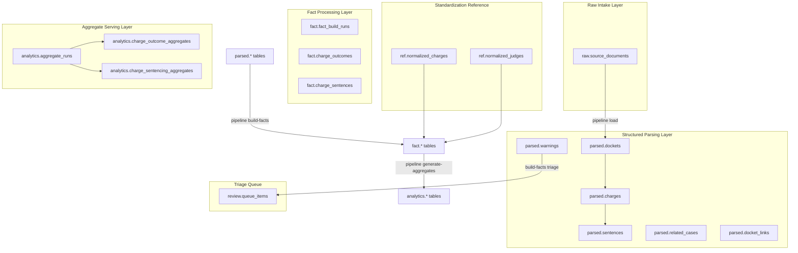

# Database Schema & Tables Guide

This document details the PostgreSQL database architecture used by the Philadelphia Court Outcomes Analytics application, detailing tables by schema layer (`raw`, `parsed`, `fact`, `ref`, `review`, and `analytics`) as defined in [types.ts](../db/src/types.ts).

---

## 1. Schema Layers Overview

The database uses a structured, multi-layered schema to ensure separation of concerns, data provenance, and fast analytics serving:

---

## 2. Layer-by-Layer Table Specifications

### 2.1. Raw Layer (`raw.*`)

Tracks raw file imports and matches metadata to the physical files stored in the outside-repo filesystems.

#### `raw.source_documents`

- **Purpose**: Serves as the first landing record for a docket PDF.
- **Fields**:
  - `id` (UUID): Primary key.
  - `file_hash` (Text): The SHA-256 hash of the PDF file (uniquely identifies the document version).
  - `original_filename` (Text): The filename (typically matching the court docket number).
  - `file_size_bytes` (BigInt): Size of the PDF.
  - `imported_at` (Timestamp): Timestamp of the import run.
  - `status` (Text): Extraction/loading status (e.g., `imported`, `parse_failed`).
  - `error_code` (Text): Error codes from parser exceptions.
  - `court_type`, `county` (Text): Captured properties of the source file.

---

### 2.2. Structured Parsing Layer (`parsed.*`)

Stores the direct outputs of the text parsing stage. These tables represent an immutable snapshotted representation of a docket sheet's text contents.

#### `parsed.dockets`

- **Purpose**: Case-level attributes parsed from the docket sheets.
- **Fields**:
  - `id` (UUID): Primary key.
  - `source_document_id` (UUID): FK matching `raw.source_documents`.
  - `docket_number` (Text): Court docket identifier.
  - `record_parser_version` / `envelope_parser_version` (Integer): Parser version tracking for database updates.
  - `defendant_hash` (Text): Cryptographically hashed representation of the defendant's name + birth year.
  - `case_status`, `filed_date`, `otn`, `dc_number`, `assigned_judge_raw`, `court_type_recorded`, `court_type_derived`.

#### `parsed.charges`

- **Purpose**: Captures each individual charge recorded on a docket.
- **Fields**:
  - `id` (UUID): Primary key.
  - `docket_id` (UUID): FK matching `parsed.dockets`.
  - `sequence` (Integer): Order of the charge on the sheet.
  - `statute`, `grade`, `offense`, `disposition_raw`, `disposition_date`, `disposition_judge_raw`.
  - `event_name`, `event_date` (Text, Date): Captured hearing schedule for pending/non-terminal charges.

#### `parsed.sentences`

- **Purpose**: Records individual sentencing components (e.g. confinement, probation) handed down for a charge.
- **Fields**:
  - `id` (UUID): Primary key.
  - `charge_id` (UUID): FK matching `parsed.charges`.
  - `sentence_type` (Text): Standardized classifications (Confinement, Probation, IPP, ARD, etc.).
  - `min_days`, `max_days` (Integer): Standardized min/max bounds in days.
  - `min_assumed` (Boolean): Flag indicating if the minimum bound was derived from a flat length.
  - `program`, `sentence_date`, `raw_text`.

#### `parsed.warnings`

- **Purpose**: Tracks anomalies or warnings encountered during parsing (such as suspected amended charges or sentinel PII collisions).
- **Fields**: `id`, `docket_id` (FK), `code` (Warning identifier), `section`, `charge_sequence`, `page`, `field`.

#### `parsed.related_cases`

- **Purpose**: Logs related docket lists printed on the docket sheet (primarily MC sheets).
- **Fields**: `id`, `docket_id` (FK), `docket_number`, `court`, `association_reason`.

#### `parsed.docket_links`

- **Purpose**: Represents explicit case linking between Municipal Court (MC) and Common Pleas (CP) dockets.
- **Fields**: `id`, `source_docket_id` (FK), `target_docket_number`, `target_docket_id` (Nullable FK, populated if the target is in the database), `link_type`, `evidence_source`.

---

### 2.3. Fact Processing Layer (`fact.*`)

Rebuilt during the fact-generation process. These tables standardise judge names and charge descriptors against the reference layer and mark cases for analytical eligibility.

#### `fact.fact_build_runs`

- **Purpose**: Catalogues each run of the fact builder.
- **Fields**: `id` (UUID), `status` (`in_progress`, `completed`, `failed`), `parser_version`, `envelope_parser_version`, `taxonomy_version`, `started_at`, `completed_at`, `counts` (JSON representation of records processed).

#### `fact.charge_outcomes`

- **Purpose**: Maps a parsed charge to normalized fields and defines its eligibility for public aggregates.
- **Fields**:
  - `id` (UUID): Primary key.
  - `build_run_id` (UUID): FK matching `fact.fact_build_runs`.
  - `parsed_charge_id` / `parsed_docket_id` (UUID): FKs to the parsed layer.
  - `normalized_charge_id` (UUID): FK to `ref.normalized_charges`.
  - `normalized_judge_id` (UUID): FK to `ref.normalized_judges`.
  - `outcome_category_code` (Text): Grouping code for outcome metrics.
  - `mvp_eligible`, `public_eligible`, `judge_specific_eligible` (Boolean): Eligibility flags gating whether this charge enters public aggregate calculations.
  - `ineligibility_reason_codes` (Text Array): Array of strings noting why a charge was excluded from calculations.

#### `fact.charge_sentences`

- **Purpose**: Maps parsed sentences to standardized sentencing categories.
- **Fields**: `id`, `build_run_id`, `charge_outcome_id` (FK), `parsed_sentence_id` (FK), `normalized_charge_id` (FK), `sentencing_category_code`, `sentence_date`, `min_days`, `max_days`, `min_assumed`, `amount_cents`, `normalized_judge_id` (FK), and eligibility flags.

---

### 2.4. Standardization Reference Layer (`ref.*`)

Static catalogs mapping raw text variations (aliases) to canonical codes.

- **`ref.normalized_charges`** / **`ref.charge_aliases`**: Normalizes charge descriptions and maps variations (e.g. spelling or spacing changes in statutes) to standardized slugs.
- **`ref.normalized_judges`** / **`ref.judge_aliases`**: Normalizes judge names, matching handwritten or misspelled inputs to standardized listings.

---

### 2.5. Triage Queue Layer (`review.*`)

#### `review.queue_items`

- **Purpose**: A workspace triage queue where warning flags, anomalous records, or parser failures are recorded for manual administrator review.
- **Fields**: `id`, `item_type`, `severity`, `source_document_id` (FK), `parsed_docket_id`, `parsed_charge_id`, `parsed_sentence_id`, `entity_type`, `raw_value`, `candidate_context`, `reason_code`, `status` (`open`, `resolved`), `dedup_key`.

---

### 2.6. Aggregate Serving Layer (`analytics.*`)

Maintains pre-computed statistics that serve client endpoints.

#### `analytics.aggregate_runs`

- **Purpose**: Records aggregation history, marking which aggregate sets are active.
- **Fields**: `id`, `status` (`in_progress`, `completed`, `failed`), `started_at`, `completed_at`, `published_at` (gated by validation checks), `invalidated_at` (set transactionally when a newer run is published), `invalidated_reason`, `parser_version`, `build_run_id` (Task 35.1 — the source `fact.fact_build_runs` id, nullable on historical rows, deliberately FK-less because `fact.*` is outside the public dump/restore set), `taxonomy_version`, `data_range_start`, `data_range_end`.

#### `analytics.charge_outcome_aggregates` & `analytics.charge_sentencing_aggregates`

- **Purpose**: Stores statistics grouped by charge code (overall counts, percentages, and flag fields showing if sample sizes are small (`is_thin_data`)).

#### `analytics.judge_outcome_aggregates` & `analytics.judge_sentencing_aggregates`

- **Purpose**: Stores statistics grouped by judge and charge code (overall outcome counts, sentencing sample sizes, and percentages).

#### Conviction-grain sentencing index (Task 35.1)

- **Tables**: `analytics.charge_sentencing_index_summaries`, `analytics.charge_sentencing_index_aggregates`, `analytics.charge_conviction_grade_aggregates`, `analytics.judge_sentencing_index_summaries`, `analytics.judge_sentencing_index_aggregates`.
- **Purpose**: Conviction-denominated sentencing statistics per charge (and per charge x judge cell). Summaries carry convictions / sentenced convictions / wedge (convictions with no public-eligible sentencing component, disclosed rather than dropped) plus the thin flag keyed on sentenced convictions; category rows carry conviction-grain counts, percentage of sentenced, and (for duration-bearing categories) component-grain median min/max days with the `min_assumed` share; the grade table (charge grain only) carries the conviction grade mix with an explicit `ungraded` bucket. Percentages are `numeric(4,1)`; medians `numeric(6,1)` days.

---

## 3. Immutability & DB Constraints

- **Kysely `Immutable<>` Guarding**: The analytics aggregates (`analytics.charge_*` and `analytics.judge_*`) and structured parse outputs (`parsed.*`) are configured with Kysely's `Immutable<>` type wrapper. The application prevents `UPDATE` actions on these tables at the database access type level.
- **Transaction Replacements**: To update records (e.g., superseding an existing parsed docket or rebuilding facts), the pipeline uses a delete-and-reinsert method within transactions rather than using `ON CONFLICT DO UPDATE`. This strategy keeps the database records cleanly aligned with the file system state.
