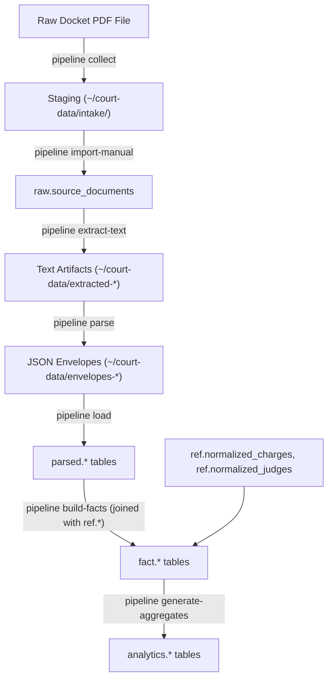

# Pipeline Architecture: Collection through Publication

This document details the end-to-end flow of the Philadelphia Court Outcomes Analytics data pipeline, from raw docket sheet collection through parsing, loading, fact rebuilding, and final public aggregates publication.

---

## 1. High-Level Architecture Diagram

The pipeline operates in a layered architecture where data is progressively structured, cleaned, and aggregated:

---

## 2. Operational Modes

The pipeline grows and maintains the database via two primary protocols:

1. **Incremental Intake**: Governs the deliberate, counted growth of the corpus with brand new, unseen dockets. Guided by [col-intake-protocol.md](intake/col-intake-protocol.md).
2. **Refresh Cycles**: Re-collects and updates existing non-terminal (still pending) cases in the corpus to pull their final dispositions and eliminate case-duration bias. Guided by [refresh-runbook.md](intake/refresh-runbook.md).

---

## 3. Step-by-Step Pipeline Flow

All steps are driven by the `pipeline` command-line utility, which has its entrypoint defined in [cli.py](../services/pipeline/src/pipeline/cli.py).

### Step 0: Collection

- **Command**: `pipeline collect`
- **Implementation**: [engine.py](../services/pipeline/src/pipeline/collector/engine.py)
- **Action**: Fetches docket PDFs from the court portal into `~/court-data/intake/` using Playwright.
- **Pacing**: Strictly limits session time (max 240m), delays requests by 2.0-5.0s, and logs misses to `miss-ledger-<court>-<year>.jsonl` to avoid re-querying known misses.
- **Freeze Step**: The contents of `~/court-data/intake/` are copied to a dated snapshot directory under `~/court-data/intake-snapshots/` with an immutable `MANIFEST.json` describing content hashes.

### Step 1: Deduplication & Filtering

- **Action**:
  - **Content-hash deduplication**: Automatically filters out byte-identical PDF files.
  - **Docket exclusion**: For normal intakes, dockets already recorded in `parsed.dockets` are filtered out at the `[0b]` step. (This step is skipped during _Refresh Cycles_ so that newer versions of the same docket can supersede older ones).

### Step 2: Import

- **Command**: `pipeline import-manual <input-dir>`
- **Implementation**: [manual_import.py](../services/pipeline/src/pipeline/manual_import.py)
- **Action**: Catalogues the files, performing SHA-256 deduplication and recording import metadata.
- **Database Target**: `raw.source_documents`

### Step 3: Text Extraction

- **Command**: `pipeline extract-text <input-dir>`
- **Implementation**: [extraction.py](../services/pipeline/src/pipeline/extraction.py)
- **Action**: Extracts text from PDFs and stores it page-by-page under `~/court-data/extracted-intake-<date>/`.

### Step 4: Envelope Parsing

- **Command**: `pipeline parse`
- **Implementation**: [envelope.py](../services/pipeline/src/pipeline/envelope.py)
- **Action**: Parses the extracted text into structural JSON envelopes under `~/court-data/envelopes-intake-<date>/`.

### Step 5: Goldens (Regression Testing)

- **Command**: `pipeline run-fixtures`
- **Implementation**: [run_fixtures.py](../services/pipeline/src/pipeline/run_fixtures.py)
- **Action**: Compares parser output against local goldens (`~/court-data/goldens/`) and initializes new ones (`--init-goldens`) if new dockets are introduced.

### Step 6: Loading (Database Upsert)

- **Command**: `pipeline load`
- **Implementation**: [load.py](../services/pipeline/src/pipeline/load.py)
- **Action**: Inserts structured docket data into the database. Versioning is checked on the tuple `(envelope_parser_version, record_parser_version)`. If a newer version is uploaded, the existing parsed data is transactionally deleted (via `CASCADE` to clear related charge/sentence rows) and reinserted.
- **Database Targets**:
  - `parsed.dockets`
  - `parsed.charges`
  - `parsed.sentences`
  - `parsed.warnings`
  - `parsed.related_cases`

### Step 7: Rebuilding Facts

- **Command**: `pipeline build-facts`
- **Implementation**: [build_facts.py](../services/pipeline/src/pipeline/facts/build_facts.py)
- **Action**: Reads the entire grown corpus, matches charges and judges against lookup tables, and inserts them under a brand-new `build_run_id`.
- **Database Targets**:
  - `fact.fact_build_runs`
  - `fact.charge_outcomes`
  - `fact.charge_sentences`

### Step 8: Generating Aggregates

- **Command**: `pipeline generate-aggregates`
- **Implementation**: [generate.py](../services/pipeline/src/pipeline/aggregates/generate.py)
- **Action**: Compiles outcomes and sentencing aggregates from facts, flagging the run status as `in_progress`.
- **Database Targets**:
  - `analytics.aggregate_runs`
  - `analytics.charge_outcome_aggregates`
  - `analytics.charge_sentencing_aggregates`
  - `analytics.judge_outcome_aggregates`
  - `analytics.judge_sentencing_aggregates`

### Step 9: Validating Aggregates

- **Command**: `pipeline validate-aggregates`
- **Implementation**: [validate.py](../services/pipeline/src/pipeline/aggregates/validate.py)
- **Action**: Runs integrity, baseline-drift, and privacy constraint checks. Any validation failure blocks publication.

### Step 10: Publishing

- **Command**: `pipeline publish-aggregates`
- **Implementation**: [publish.py](../services/pipeline/src/pipeline/aggregates/publish.py)
- **Action**: Sets the validated aggregate run status to `completed` and fills in `published_at` while transactionally invalidating the previous published run (`invalidated_at`).

---

## 4. Serving Public Data

Once an aggregate run is published:

- **The API Service (`apps/api`)** (Fastify + TypeScript) serves endpoints under `/api/v1/public/*`, querying the active published `aggregate_run_id` dynamically.
- **The Web App (`apps/web`)** (Next.js) requests this public-facing data to render clean outcome and sentencing visualizations for the users.
